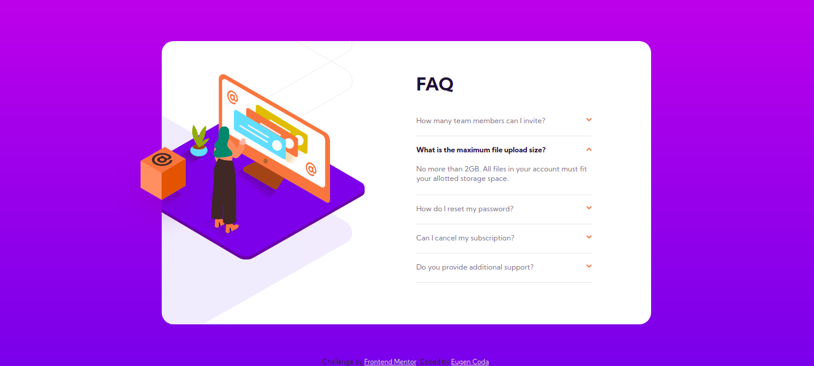
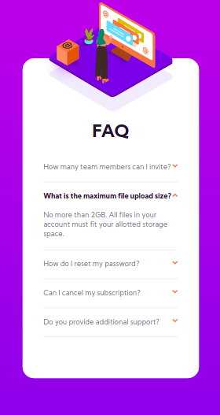

# Frontend Mentor - FAQ accordion card solution

This is a solution to the [FAQ accordion card challenge on Frontend Mentor](https://www.frontendmentor.io/challenges/faq-accordion-card-XlyjD0Oam). Frontend Mentor challenges help you improve your coding skills by building realistic projects.

## Table of contents

- [Overview](#overview)
  - [The challenge](#the-challenge)
  - [Screenshot](#screenshot)
  - [Links](#links)
- [My process](#my-process)
  - [Built with](#built-with)
  - [Useful resources](#useful-resources)
- [Author](#author)

## Overview

### The challenge

Users should be able to:

- View the optimal layout for the component depending on their device's screen size
- See hover states for all interactive elements on the page
- Hide/Show the answer to a question when the question is clicked

### Screenshot

### Links

- Solution URL: [GitHub Repository] (https://github.com/EugenCoda/frontend-mentor-FAQ-accordion-card-main)
- Live Site URL: [FAQ Accordion Card](https://profile-card-component-frontend-challenge.netlify.app/)

## My process

### Built with

- Semantic HTML5 markup
- CSS custom properties
- Flexbox
- CSS Grid

### Useful resources

- [How TO - Collapsibles/Accordion](https://www.w3schools.com/howto/howto_js_accordion.asp) - This inspired me to create the accordion with very few lines of code, which are also easy to understand.

## Author

- Website - [Eugen Coda](https://eugencoda.github.io/)
- Frontend Mentor - [@EugenCoda](https://www.frontendmentor.io/profile/EugenCoda)
- Twitter - [@coda_eugen](https://www.twitter.com/coda_eugen)
